# 智能运维------问题发现
========================================

                                    异常检测，基线系统          
-------------

 
1. 应用背景
--------------------------
  
### 1.1 如何设定阀值
          固定阀值存在的问题；（对于业务类的监控数据无固定的阀值）
          简单环比存在的问题：（存在持续偏离）   

### 1.2 数据基线
          现有的基线系统：简单的同比，（无法排除故障点，及异常点）
          业务数据的周期漂移
          
### 1.3 监控数据趋势预测，主动发现故障
          对于存在缓慢增长，或缓慢下跌的业务指标
          
### 1.4 异常点的捕获
          对不大部分监控系统的指标，在一段较小的时间内，应该是平稳的，若出现较大的变动，则对应着系统故障，  
          或者系统重大变更。
          
        
        
        
2. 基本方案
-------------------------------
       

## 2.1  基线系统结构

       基线系统结构如下：
  
   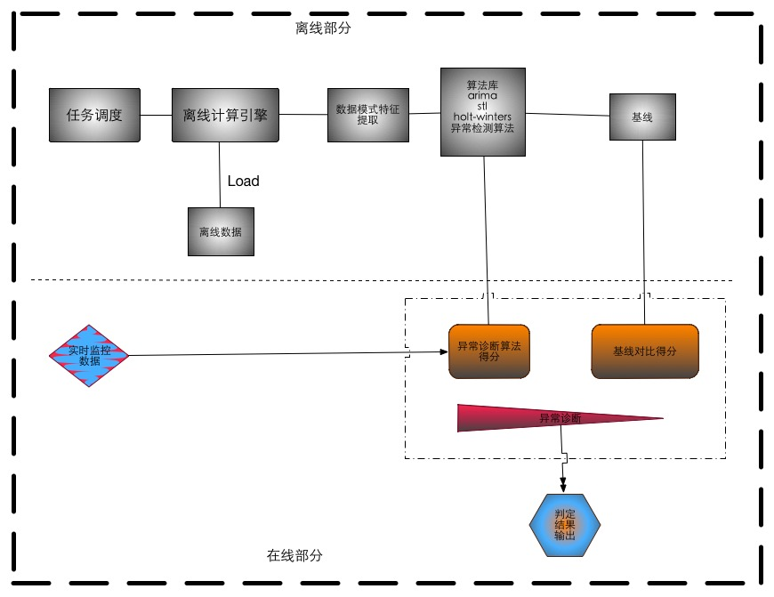

    
                                                                                  

## 2.2 基线算法的理论来源

        理论上说监控采集的所有数据，都可以看作或者转换为时间序列。对应监控数据的分析，实则对时间序列的分析。不同的时间序列具有不同的特征，利用这些特征，我们可以对时间序列精准的分析。  
    因此，首先对按照时间序列的特征，对其分类；其次，根据这些特征选择合适的算法模型，对时间序  
    列进行分析,预测。

3. 时间序列的几个重要特征
-----------------------

  
## 3.1  时间序列的特征及其判定方法

#### 周期性
*  周期序列的定义：  
   在数学中，周期函数是无论任何独立变量上经过一个确定的周期之后数值皆能重复的函数。
   对于实数或者整数函数来说，周期性意味着按照一定的间隔重复一个特定部分就可以绘制出完整的函数图。  
   如果在函数 f 中所有的位置 x 都满足:  
    
   f(x + T) = f(x)  
   
   那么，f 就是周期为 T 的周期函数。
    
 * 若一个数据序列为周期序列，我们可以取一个周期的数据来预测下个周期的数据。
   
*  如何判断一个时间序列是否有周期性

      >  [KS-test] (http://www.physics.csbsju.edu/stats/KS-test.html)  
      
         验证两个数据序列是否具有同分布. 我们可以通过验证两个时间序列是否服从相同的概率  
         分布，大致判断两个数据序列是否有周期性。
  
  * 其它类周期函数及其定义
         
      > [概周期函数](https://zh.wikipedia.org/wiki/%E6%A6%82%E5%91%A8%E6%9C%9F%E5%87%BD%E6%95%B0)  
        
      概周期函数（或殆周期函数）是一类有近似于周期性质的函数，是连续周期函数的推广。  （参见wiki）  概周期函数有若干个等价定义。  
      根据哈那德·玻尔引进的分析学上的定义，一个定义域在实数域上  的连续函数  如果满足：对任意正实数，都存在实  
      数，使得任意长度为 的区间里至少存在一个数，使得对于任意的，都有:  
      
        
      
       按照定义，所有周期函数都是概周期函数。  

      >  [准周期函数](https://zh.wikipedia.org/wiki/%E5%87%86%E5%91%A8%E6%9C%9F%E5%87%BD%E6%95%B0)
        
      在数学上准周期函数是指一个函数有类似周期性函数的性质，但不满足严格的周期函数。更准确的说法，一函数为f为 准周期函数，且有准周期若  
        其中是一个比简单的函数,注意此处的“简单”是一个模糊的概念.  
       一个简单的例子（有些称为算术准周期）为其函数满足下式
  
      
        
      另一个的例子（有些称为几何准周期）为其函数满足下式；  
        
        
      
      >[应用实践中，判定时间序列是否具有周期性的方法]()  
        
      从上面的定义可以看出，若一个时间序列具有周期性，我们可以取两个周期的数据构成两个时间序列，应用上述的公式来验证。应用实践中，我们可以假设某个监控数据具有周期性，（通常，我们假设周期为一天，或一周），一个简单的算法描述如下:  
  * 假设某时间序列为周期序列（假设周期为1day/1 week）
  * 提取相邻的两个周期的数据，构成原始序列 S1,S2
  * 计算 S1,S2 的差值序列｛S1-S2｝,(或比值序列{S1/S2})得时间序列 S3;
  * 计算S3的期望，E(s3); 计算｛S3 - E(s3)｝得 时间序列S4
  * 判断S4是否服从标准正态分布，若服从则认为改序列为周期序列
  
 

  
  
####  平稳性
*   定义（宽平稳性）       

  如果时间序列｛Yt,|t=1,2,3,....,T｝的数据期望，方差，和协方差不随时间变化。  
  E(y_(t))=mu,   
  
  Var(y_(t))=sigma^2  
  
  >> 对于时间序列的分析模型，大部分是针对平稳时间序列的
    
####  非平稳时间序列

         对于一个非平稳的时间序列，通常的处理办法是，将其转化为平稳的时间序列
     基本思路是： 对原始序列进行差分，（可以多阶差分），得到平稳数据序列

## 3.2  时间序列分析的算法模型

     上面已经提到，现实中的监控数据，并不会严格的属于周期的，因为可能随着时间做缓慢变化，比如交易量，肯能会随着业务的发展而发展；但是  
     从一天，一周来看，又具有较强的周期性，我们可以通过将时间序列进行分解，来求出其稳定的分量，把其它不确定的因素作为随机分量过滤掉，  
     就可以得到比较准确的预测分析基线。
 
*   时间序列分解模型

    加法模型：  
    
    

    乘法模型：
     
    
     
    混合模型：
    
       
     
    ）  
    
    我们可以通过对时间序列取对数转换，将乘法模型转换为加法模型：  
    
    Log Yt = Log St + Log Tt + Log Et 
    
    >>  如何选择合适的时间序列分解模型？  
      若季节分量相对趋势分类独立，不随趋势的变化而变化，则考虑加法模型；
      若解决分类随着趋势变化，则考虑乘法模型；
      若时间序列的值在一个恒定值（如 0 值）附近波动，而且季节分类的幅度相对趋势独立，  
      则考虑用混合模型 
     

*   时间序列回归模型

    若一个时间序列为平稳时间序列，通常可用回归模型来分析
    
    [ARMA模型](https://zh.wikipedia.org/wiki/ARMA%E6%A8%A1%E5%9E%8B) 
    
    
    自回归（AR）模型：  
    若时间序列值xt可表示为它的先前值xt-1和一白噪声的线性函数，则称此模型为自回归模型，相应的序列xt称为自回归序列  
    
    
     

    滑动平均（MA）模型:  
    > 滑动平均模型描述的是自回归部分的误差累计
    
    
     
    简单滑动平均（Simple Moving Average）:
   
    例如:  
    MA(3) = T(t) = 1/3 (Y(t-1) + Y(t) + Y(t+1))
    
    加权滑动平均:
    
  
    自回归滑动平均（ARMA）模型 ： 
   
     
    ARIMA模型
 
        ARIMA模型( Autoregressive Integrated Moving Average model)： 差分整  
        合移动平均自回归模型，又称整合移动平均自回归模型（移动也可称作滑动），时间序列  
        预测分析方法之一。ARIMA（p，d，q）中，AR是"自回归"，p为自回归项数；MA为"滑  
        动平均"，q为滑动平均项数，d为使之成为平稳序列所做的差分次数（阶数）。“差分”一  
        词虽未出现在ARIMA的英文名称中，却是关键步骤。

    ARIMA（p，d，q）模型是ARMA（p，q）模型的扩展。ARIMA（p，d，q）模型可以表示为：  
    
        
     
          
         ARIMA模型运用的流程
	      1. 根据时间序列的散点图、自相关函数和偏自相关函数图识别其平稳性。
	      2. 对非平稳的时间序列数据进行平稳化处理。直到处理后的自相关函数和偏自相关函数的  
	         数值非显著非零。
	      3. 根据所识别出来的特征建立相应的时间序列模型。平稳化处理后，若偏自相关函数是  
	         截尾的，而自相关函数是拖尾的，则建立AR模型；若偏自相关函数是拖尾的，而自相关       
	         函数是截尾的则建立MA模型；若偏自相关函数和自相关函数均是拖尾的，则序列适合  
	         ARMA模型。
	      4. 参数估计，检验是否具有统计意义。
	      5. 假设检验，判断（诊断）残差序列是否为白噪声序列。
	      6. 利用已通过检验的模型进行预测。
	      
   
   应用举例：
   
   * 时间序列的趋势分量提取
     若一个序列不存在明显的季节，可通过 MA 获取该序列的趋势分量，如下图，
       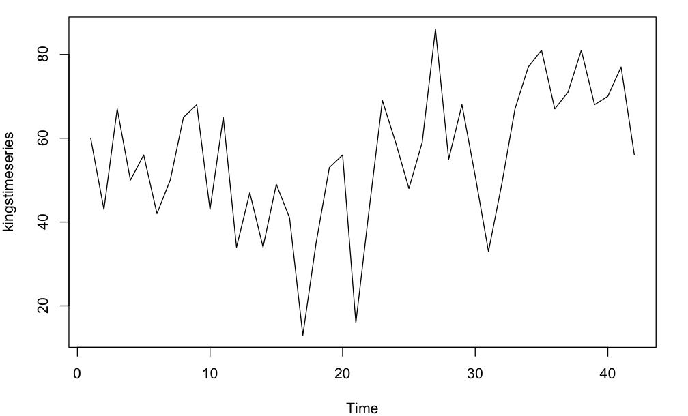  
      对该序列取滑动平均,
       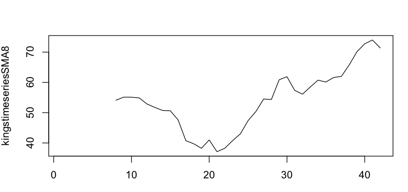
  
   
   * 鹰眼获取某个应用TPS 的历史数据
   原始时间序列画图如下：
     
     
    该序列具有较强的周期性，而且周期分量相对趋势独立，可用加法模型
      
   *  应用加法模型，对原始数据进行分解，得到各分量图如下：
      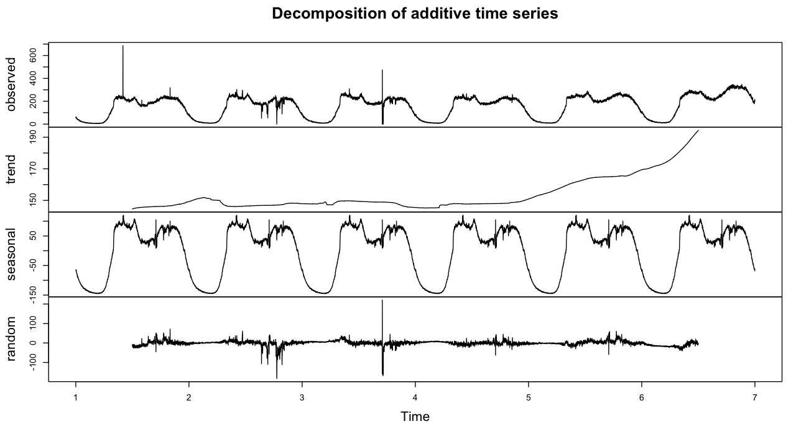
      
      获取季节调整分量：
      
      src_seasonally_adjusted <- src_data - src_components$seasonal
      
      季节调整的时间序列如图：
      
      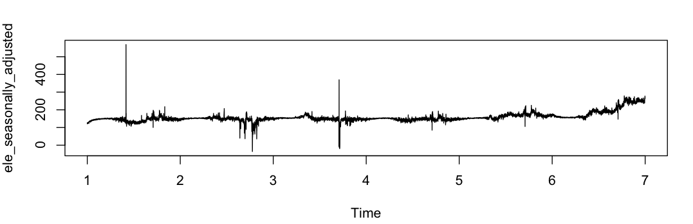
      
      
      
      
4.时间序列的预测与应用
-----------------------

    
##4.1 基于 holt-winters 模型 的预测分析
 
   holt-winters 是基于时间序列分解的算法模型。 其计算公式如下：
      
   
      
   其中，  
        alpha: 为趋势截距 ，反应了当前数据对过去数据的依赖程度，若alpha越大，说明越近的数据对当前值的影响越大，
               反之，则说明当前数据的值，不仅与离当前数据近的值有关，离当前数据远的值也有关
        b_t: 为趋势斜率 ， 
        c_t: 为加法模型的季节因子  ，
        
   利用holt-winters 对 鹰眼某应用服务的 TPS 指标进行预测，结果如下：
      
   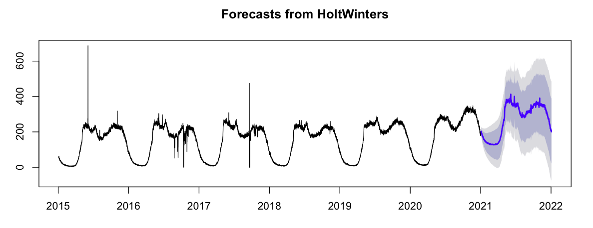
      
   其中，蓝色的曲线为预测下一天的基线数据，深蓝色的为95%的置信区间，浅灰色为80%的置信区间
   
      
##4.2 基于 ARIMA 模型 的预测分析
      
      指数平滑方法预测 的前提是：时间序列服从正态分布，且不相关
      某些场景，若把序列的相关性纳入考虑会得到更好的结果。  
      ARIMA 可以预测 随机分量的自相关系数非0的时间序列
      
      ARIMA 的前提是时间序列为平稳的，因此第一步是将非平稳 的时间序列转换为平稳的时间序列，
      具体做法如下：

### 不带季节分量的 ARIMA 模型
    
   * 取鹰眼某一天的监控数据，如下：
  
   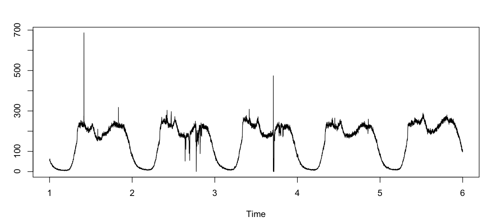

   * 一阶差分后的序列如下 
    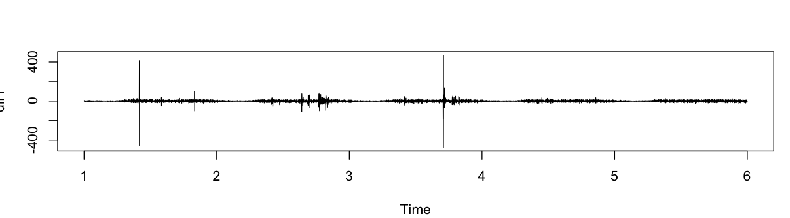

   
   可以看出改序列基本服从均值为0，方差为0的正太分布，该序列为平稳序列。
    
        检测一个序列是否稳定，可以用 adf.test. 
        adftest(Augmented Dickey-Fuller Test) 即单位根检验. 单位根检验是指检验序列中是否存在单位根，因为存
        在单位根就是非平稳时间序列了。  
        单位根就是指单位根过程，可以证明，序列中存在单位根过程就不平稳，会使回归分析中存在伪回归

    
  ARIMA（p,d,q） 三个参数中，d 表示差分的阶数，在本序列中取1即可。
    
  接下来，确定p,和 q , 通常用相关图，或偏相关图来确定 
  acf(), pacf();
  
  acf 如图：
  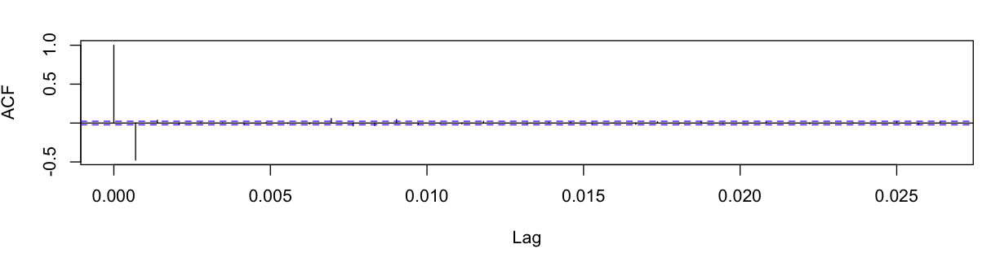
  
  pacf 如图：
  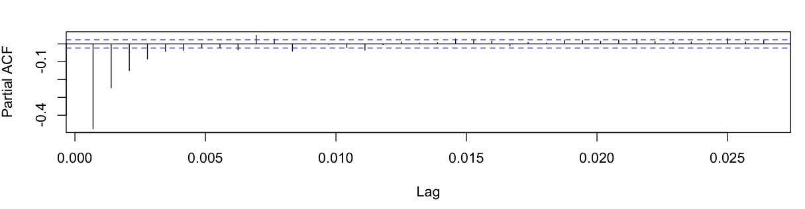
    
  根据acf,及 pacf 可以确定 arima 的p 和 q 
    
  在R 中，可以使用auto.arima(ts) 获取 arima 的 p ,d ,q
  
  若直接用arima 函数，则得到的是不带季节分量的预测值，如图：
   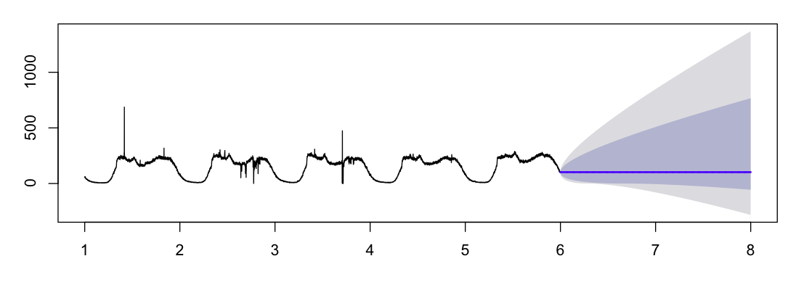
  
  
  可见，不带季节分量的 arima 只能做短期预测，预测不准确，我们将一天划分为1440个点，每个周期为1440，可建立季节分量
  存在的问题：
    R 中的arima 函数对于季节周期的限制最大为350,超过此数会导致内存溢出；在我们的例子中，按分钟采集数据，一 天1440个点，因此有1440个季节分量；通过傅立叶变换，将数据映射到一个周期内；
  
  公式如下：
  
   

  其中，  
    为 ARIMA 过程
    K 为 AIC 的最小项，
    
  * 带季节的ARIMA模型预测结果如下：
   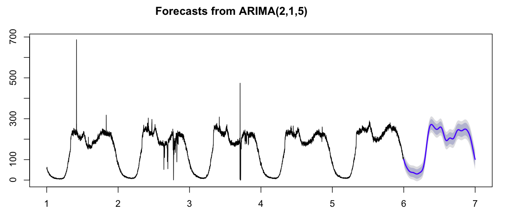

   
  
 
##4.3 基于 STL 模型的预测分析
 
     fit_stl <- stl(ele,s.window="periodic")
     plot(forecast(fit_stl))
  
  STL 是基于Loess 的时间序列分解模型，基本思想是利用 loess 算法模型对时间序列的局部进行回归
  
 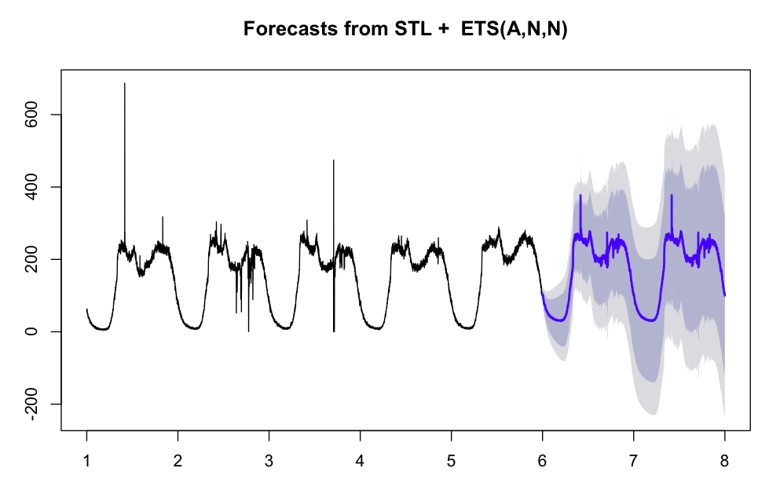

##4.4 其他预测模型

* 基于神经网络预测混沌时间序列
  对于周期性不强,且波动较大的时间序列
  

* 基于灰度模型的预测

* 周期时间序列的分段拟合

* 时间序列分解

  基线 holt-winters svd spa stl
  
  异常检测： skyline , esd  mad twiter
  
  参数条调优化，    sbfgs;
  
  
  损失函数：loess
  
  
  

5.异常检测算法
-----------------------

      
* 业界内的异常检测相关项目及算法
  
  [skyline](https://github.com/etsy/skyline) 
  
  [twiter](https://github.com/twitter/AnomalyDetection)  
  
  
  [yahoo](https://github.com/yahoo/egads)  
  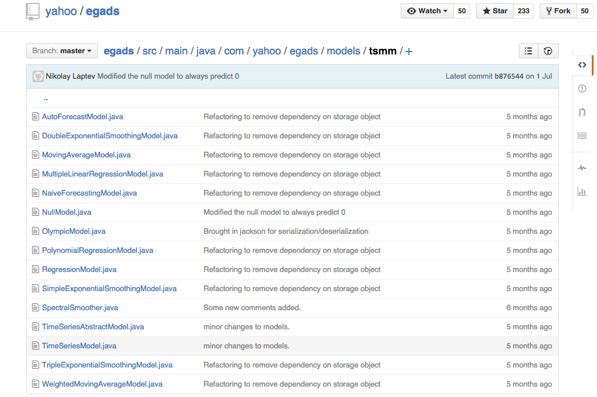
    
 
  [control chart]()  
 skyline 异常检测算法介绍及meissa在实践中的应用
--------------------------------------------------

   meissa 的异常检测算法结合了skylin的异常检测算法 ，以及和基线对比检测
   
   
   我们重写了skyline的异常检测算法，结合自己的监控业务场景，定义了监控指标的异常评分准则：
     
   score =  skylinescore + baseline_anormaly_score
      
   
   
## 实际案例
  * 下图为11月某次故障时，我们系统检测的结果，
     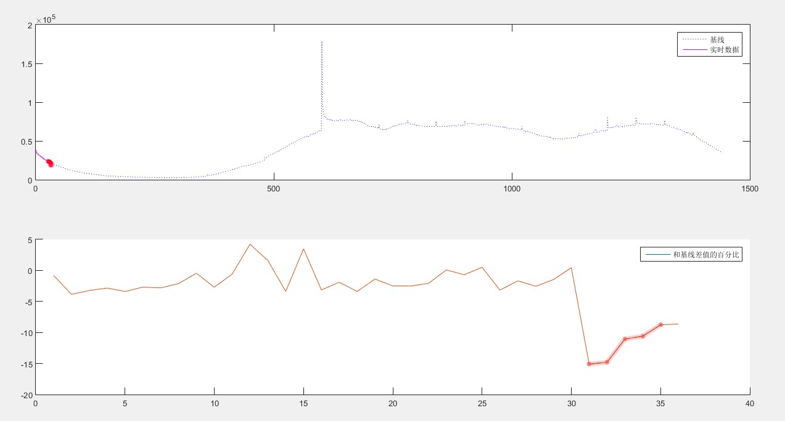
   
   
   
Related Links； 
---------------------------------
  
   
   *  [weka进行数据分析] (http://wiki.pentaho.com/display/DATAMINING/Time+Series+Analysis+and+Forecasting+with+Weka)
   *  [R 时间序列分析](http://www.maths.manchester.ac.uk/~gb/R/Rtsbasic.pdf)
   *  [matlab 进行数据分析]
   *  [时间序列分析网站](http://support.sas.com/rnd/app/ets/cap/ets_forecasting.html)
   *  [时间序列，周期计算公式](http://robjhyndman.com/hyndsight/seasonal-periods/)
   * [anomaly-detection techniques](https://iwringer.wordpress.com/2015/11/17/anomaly-detection-concepts-and-techniques/)
   * [seasonal  arima](http://robjhyndman.com/talks/RevolutionR/10-Seasonal-ARIMA.pdf)
   * [seasonal arima example](https://www.otexts.org/fpp/8/9)
   * [ADF test](https://en.wikipedia.org/wiki/Augmented_Dickey%E2%80%93Fuller_test)
   * [stl forecast](http://www.rdocumentation.org/packages/forecast/functions/forecast.stl)
   * [stl paper](http://www.wessa.net/download/stl.pdf)
   * [forecast blog](http://robjhyndman.com/hyndsight/forecasting/)
   * [Rob j Hyndman R packages github address](https://github.com/robjhyndman/forecast)
   * [其它获取时间序列周期的方法](http://dept.astro.lsa.umich.edu/~msshin/science/code/MultiStep_Period/)         
   
   
    		
				
6.附录
-----------------------

## 时间序列特征

#### * 自相关函数
     
  
     
     

      ：期望值 
      
 
      ：在t(i)时的随机变量值
      

      ：在t(i)时的预期值
      

      ：方差

 

#### * 协方差
 
 
 
 
 协方差的相关性η：  
 
 
  
 

  η，是一个衡量线性独立的无量纲数，其取值在[0,+1]之间。相关性η = 1时称为“完全线性相关”
  
  如果X 与Y 是统计独立的，那么二者之间的协方差就是0；
 

### * ControlChart 模型

* wiki 的简介  

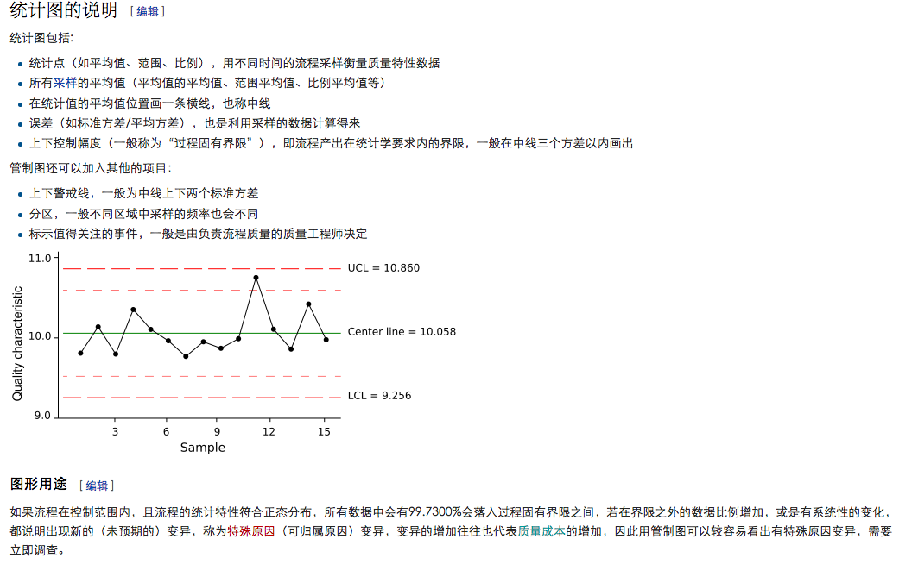

* 理论基础
切比雪夫不等式（Chebyshev's Inequality）：显示了随机变数的“几乎所有”值都会“接近”平均。切比雪夫不等式，对任何分布形状的数据都适用
公式如下：

  
  其中：设X为随机变数，期望值为，标准差为\sigma。对于任何实数k>0， 

Shewhart 以三个标准差（3σ）作为界限，其原因如下：

   1. 依照切比雪夫不等式的较粗略结果：对于任何概率分布，结果超过平均值的k个标准差的概率不超过1/k2。

   2. 正态分布是相当常见的概率分布，其中99.7%的点落在三个标准差中（参见正态分布）。
   
   3. 依照Vysochanskii-Petunin不等式的较粗略结果：对于任何单峰概率分布，结果超过平均值的k个标准差的概率不超过4/(9k2)。

    

 
## 异常检测分析算法

### 1 Kolmogorov-Smirnov_test
     具体实现是：计算序列内最近十分钟的数值的ks测试分布，然后计算序列中最近一个小时前
     到十分钟前这 50 分钟的数值的ks测试分布；如果两个分布相差较大，即判断为异常

This is [an example](http://example.com/ "Title") 

 
